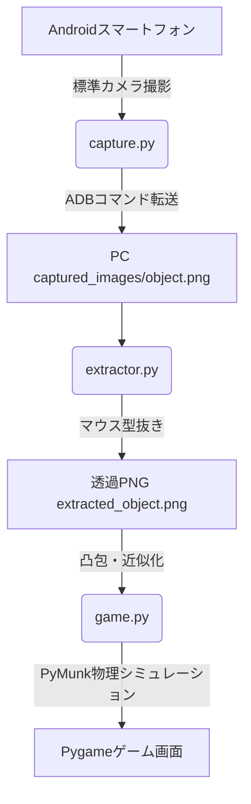

# リアル物体タワーバトルゲーム (Real Object Tower Battle)

本プロジェクトは、AndroidスマートフォンとPCを接続し、手動撮影した写真からPC上で高精度に物体を透過型抜き（抽出）し、その物体を2D物理エンジン上で積み上げて遊ぶ「どうぶつタワーバトル」風のリアル物理積み上げゲームです。

---

## 🛠️ システム構成と使用技術

本システムは主に3つのモジュールから構成され、それぞれの機能で最適な画像処理・物理演算技術を使用しています。

---

## 1. カメラ入力および自動転送・消去 (`capture.py`)
スマートフォンのカメラでの撮影を検知し、自動的にPC側へ画像を転送・管理するモジュールです。

* **ADB（Android Debug Bridge）経由のデバイス連携**
  * Androidデバイス内の標準カメラ保存先（`/sdcard/DCIM/Camera/` など）をポーリング監視します。
  * `subprocess` を用いて `adb pull` コマンドを実行し、新しく撮影された画像をPC側の一時領域（`captured_images/object.png`）へ転送します。
  * 転送完了後、スマホのストレージ圧迫を防ぐため、`adb shell rm` でスマホ側のオリジナル写真を即座に削除します。
* **OpenCVによるリアルタイムプレビュー**
  * 撮影完了後、PC側に切り出し確認用のプレビュー画面を表示します。`cv2.putText` によるキー操作ガイド（E: 確定, R: 撮り直し, Q: 中断）を画像の解像度に合わせて動的スケーリングして描画します。

---

## 2. マウスズーム連動フリーハンド型抜き透過抽出 (`extractor.py`)
環境の明るさや背景の複雑さに依存せず、ユーザーが指定した物体を正確に透過PNGとして切り出すための高精度画像処理モジュールです。

* **ウィンドウ座標 ➔ 元画像座標への逆スケーリング**
  * OpenCVのマウスコールバック（`cv2.setMouseCallback`）を利用し、ドラッグ操作の軌跡を取得します。
  * `w`/`s` キーまたは十字キーによる「マウスポインタ中心の動的ズーム機能」を搭載。ズーム倍率および表示オフセットを考慮し、ドラッグ時の画面上座標から元画像の絶対座標へとリアルタイムに逆変換して座標リストを蓄積します。
* **ソリッドマスク生成とアルファチャンネル結合**
  * 蓄積された絶対座標リストに基づき、`cv2.fillPoly` を実行して「内側を255（白）、外側を0（黒）」としたマスク画像を生成します（GrabCut等の自動二値化の計算ミスを一切挟まないソリッドな切り抜きを実現）。
  * 元画像のRGBチャンネルに、生成したマスクをアルファチャンネル（透過情報）として `cv2.merge` で結合し、範囲外を100%完全透過にします。
* **最小外接矩形トリミングと高品質リサイズ**
  * 抽出した物体の余白を完全に排除するため、`cv2.boundingRect` で最小外接矩形を計算してクロップします。
  * ゲームの公平性を保つため、ゲーム内基準最大幅（`target_size`）に対し、アスペクト比を完全維持したまま `cv2.INTER_AREA`（面積平均法）アルゴリズムで高品質縮小リサイズし、4チャンネル透過PNGとして保存します。

---

## 3. Pygame ＆ 2D物理演算統合システム (`game.py`)
切り抜いたオブジェクトに物理的性質（コライダー、重さ、摩擦、反発）を与え、積み上げゲームとして処理するメインモジュールです。

* **凸多角形（Convex Poly）コライダーの自動生成**
  * 透過PNGのアルファチャンネルから `cv2.findContours` で最外周の輪郭を再取得します。
  * 物理演算の負荷軽減と安定化のため、`cv2.approxPolyDP` で頂点数を最適化（多角形近似）します。
  * PyMunkの仕様（時計回りの凸多角形のみ対応）に適合させるため、`cv2.convexHull` で凸包頂点リストに変換し、`pymunk.Poly` コライダーとして動的ボディへバインドします。
* **物理的な重心（Centroid）のズレ補正処理**
  * PyMunkはオブジェクトの重心を中心に回転や移動を計算しますが、Pygameは画像の左上を起点に描画します。
  * このズレによる回転時のブレを防ぐため、物体の重心（Centroid）を OpenCV のモーメント (`cv2.moments`) から算出し、重心が画像の中心と一致するように透過余白を動的に付与する補正処理（`center_image_on_centroid`）を行っています。
* **物理空間（PyMunk 2D）の制御**
  * 各オブジェクトや土台に `friction`（摩擦力）と `elasticity`（反発係数）を適用します。PyMunkの仕様（摩擦・反発は衝突オブジェクト同士の乗算で決定する）に合わせ、UIスライダーの値を動的にステージ側とオブジェクト側の双方へリアルタイム同期させています。
  * `space.on_collision` を用いて、画面外下部に配置された非表示の静的センサーとオブジェクトの衝突を検知し、厳密な「ゲームオーバー判定」を行います。
* **非ブロッキングUI・マルチプロセス管理**
  * モード1での撮影中やモード3での切り抜き（単発・一括）などの外部プロセス呼び出し中、親プロセス（ゲーム画面）がフリーズしたりOSから「応答なし」と見なされたりするのを防ぐため、`subprocess.Popen` を採用。
  * サブプロセスが動作している間も、Pygameのイベントループを裏で回し続け、直前のゲーム画面スナップショットの上にうっすらと半透明の黒マスクを重ねたオーバーレイ画面（`run_subprocess_with_pygame_loop`）を表示したまま維持します。

---

## 🎮 ゲームモード

* **Mode 1：Live Capture Mode (リアルタイム撮影・型抜きバトル)**
  * ターン開始ごとにスマホ撮影と手動抽出プロセスが自動で起動し、その場で切り抜いた新しいオブジェクトを落下させます。
* **Mode 2：Random Stock Mode (ストックランダムバトル)**
  * 登録済みのストック画像フォルダ（`captured_images/stock/`）からランダムにオブジェクトが選ばれ、スポーンします。
* **Mode 3：Manage Stock Mode (ストックライブラリの管理)**
  * **SHOOT & EXTRACT**: スマホで撮影し、その場で型抜きしてストックへ新規登録します。
  * **BATCH EXTRACT (raw_stock/)**: `captured_images/raw_stock/` に未処理画像（ネットからダウンロードした画像など）を複数配置しておき、一気に連続で手動抽出を行い、抽出完了した画像から自動削除してストック登録します。
  * **Delete**: 登録されているストックのサムネイルをグリッド一覧（ページネーション付き）で表示し、不要なものを直接ファイル削除できます。